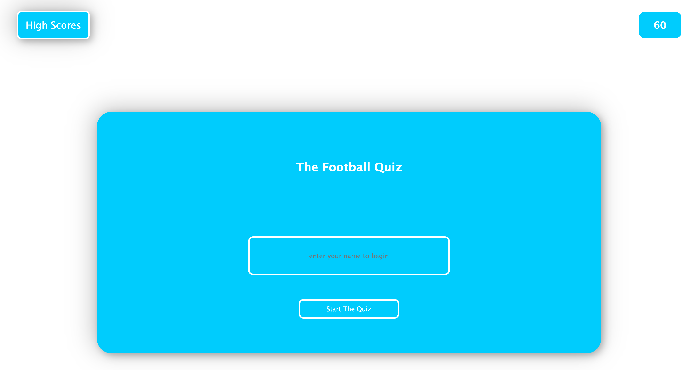
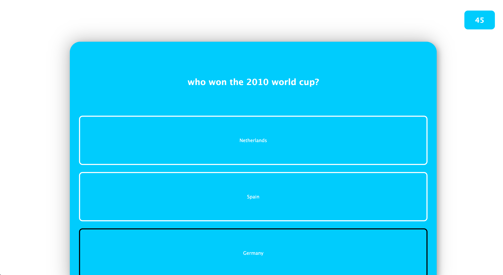
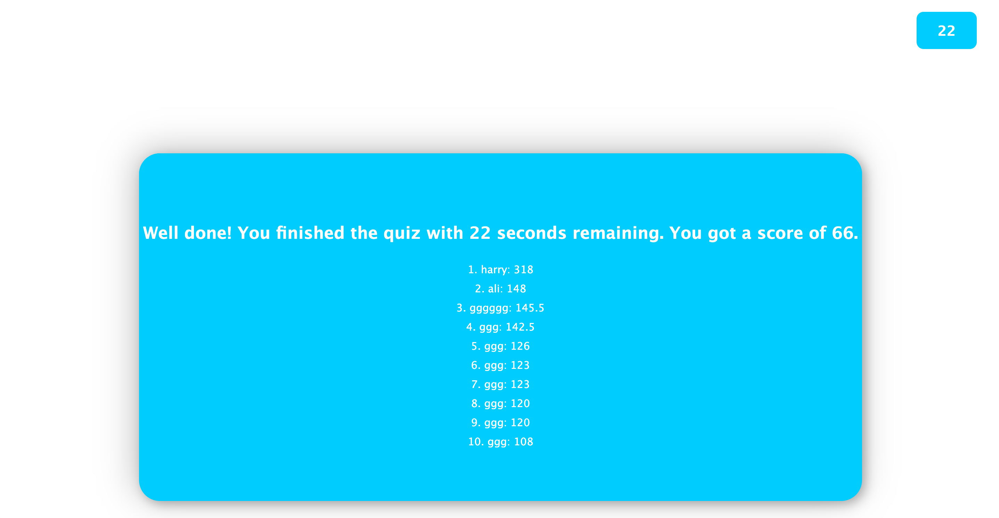

# week-4-challenge
# Quiz App

This is a quiz application that tests your knowledge on football. It presents a series of multiple-choice questions and calculates your score based on the number of correct answers and the time taken to complete the quiz. so if you took 30 seconds to complete the quiz and you got 3 questions right you would get a score of 180. this is because you get two points for each question you get right so if you got 3 right you'd have 6 points.

## Motivation

The motivation behind developing this application was to create an interactive and engaging way for users to test their knowledge on football. The project aimed to showcase the use of JavaScript, DOM manipulation, and local storage to create a dynamic quiz experience.

## Features

- User-friendly interface with a welcome screen, quiz screen, and summary screen.
- Timer functionality to track the time remaining for each quiz.
- Local storage to store and display the top ten scores.
- Interactive quiz with multiple-choice questions.
- Dynamic rendering of questions and options.
- Calculation of score based on correct answers and time remaining.

## Technologies Used

- HTML
- CSS
- JavaScript

## Usage

1. Clone the repository.
2. Open the index.html file in a web browser.
3. Enter your name and click the "Start Quiz" button.
4. Answer the multiple-choice questions within the given time limit.
5. At the end of the quiz, view your score and see if you made it to the top ten.

## Link

A live link to the application can be found here: https://ali-mo12002.github.io/week-4-challenge/

## Screenshots

## Future Development

- Add more quiz categories and questions.
- Implement a feature to allow users to create their own quizzes.
- Improve the UI/UX design for a more visually appealing experience.
- Add social sharing functionality to share quiz results on social media platforms.

